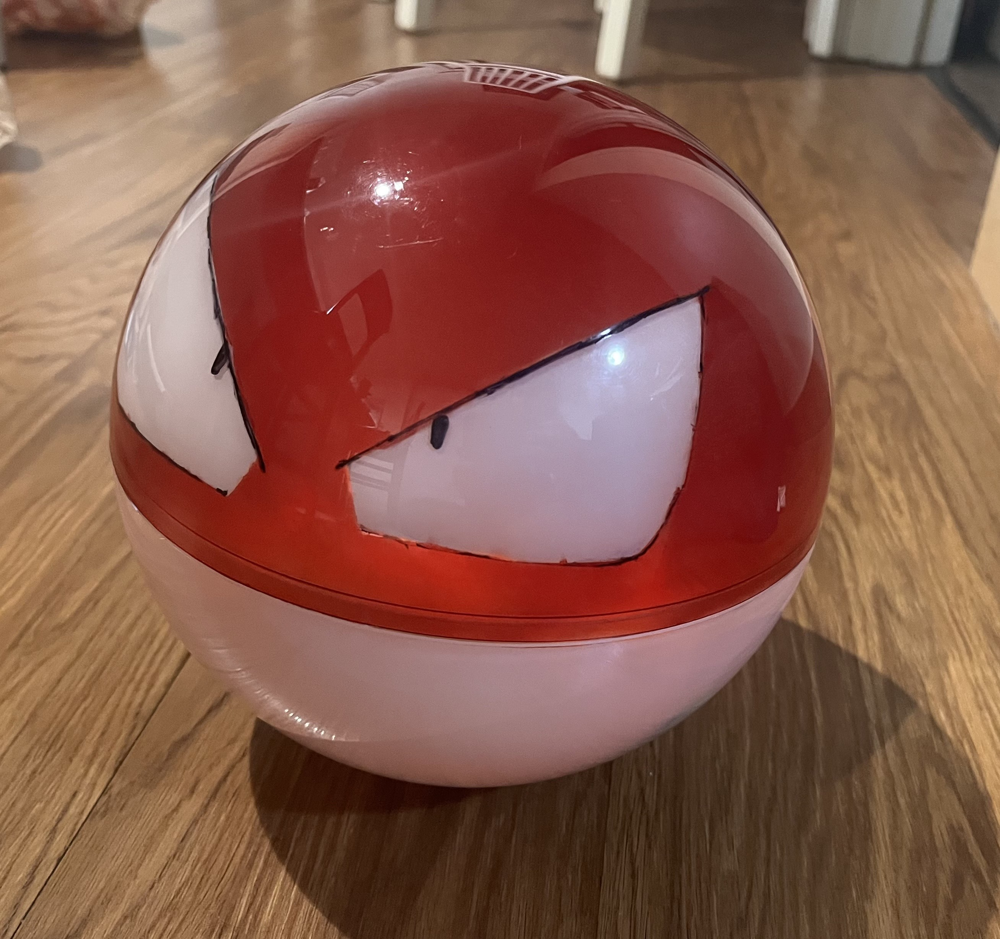

# Pokemon Model Voltorb (WIP)

## Overview
- A robotic model of the Pokemon Voltorb, a sphere-shaped Pokemon which looks like a Pokeball.  Rolls in response 
to joystick controls and 'explodes' on command
-  Work in Progress, in early protype stages

## Features (Planned vs Current)  
- Current: Joystick control can manipulate voltage output by motor controller through Wi-Fi
- Current: Wiring is a mess and needs to be completely restructured
- Planned: Controlling rolling motion through joystick and Wi-Fi
- Planned: 'explosion', on button press Voltorb will light up and make a booming sound

## Repository Structure
- `docs/` → BOM, Notes 
- `firmware/` → ESP32 firmware (Arduino FreeRTOS)
- `hardware/` → Wiring Diagrams
- `images/` → Photos

## Bill of Materials
See [BOM.md](docs/BOM.md)

## Photos

*Voltorb's body, a painted ornament ball.*

*Chassis inside of Voltorb's body.*

Additional photos can be found in [images/](images/).

## Wiring Diagrams

*Joystick controller wiring.*

*Wiring connecting ESP32, voltage regulators, and motor controller.*

## Current Status
- Motor Controller output verified and can be controlled with joystick through Wi-Fi
- Motors themselves are not connected properly and cannot be controlled
- Wiring for the 'internals' (The connections between the motor controller, ESP32, Voltage Regulators) is a mess.  I should not have made the decision to leave one million wires floating and instead just used a breadboard for prototyping.  I was hoping to compress it into the chassis, but I see that this isn't viable.

## Next Steps
- Rewire internals on breadboard for stability
- Build or purchase a larger chassis
- Test basic motor control and rolling
- Restructure firmware for modularity
- Implement new features (LED lighting, explosion sound)

